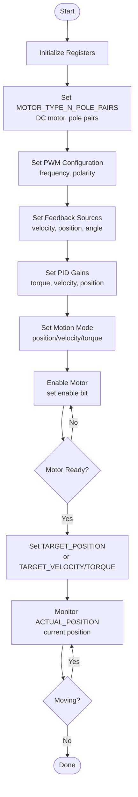

# Detailed Design – TMC4671 Motor Controller

This document describes the design for controlling a brushed DC motor using the TMC4671 servo controller via SPI1 on STM32U545RE-Q NUCLEO board.

---

## Hardware Configuration

- **Motor Controller**: TMC4671 (SPI interface) - Servo controller with position/torque/velocity control
- **H-Bridge**: DRV8837E (TI) - Power stage for motor current
- **Motor Combo**: Maxon B82E5B6EF273
  - **Motor**: DCX08M EB KL 2.4V (brushed DC)
  - **Encoder**: ENX 8 MAG 256IMP (256 counts/rev, ABN incremental, 3-channel)
  - **Gearhead**: GPX08 A 64:1 gear ratio
- **MCU**: STM32U545RE-Q NUCLEO Board
- **SPI Interface**: SPI1
- **RTOS**: ThreadX

**Encoder Specifications:**
- Base resolution: 256 counts per revolution (256 IMP)
- Effective resolution: 1024 ticks/rev (with 4× quadrature decoding)
- Output shaft resolution: 65,536 ticks/rev (1024 × 64 gear ratio)
- Type: Magnetic incremental encoder, CMOS 3.3V single-ended
- Channels: A, B, Index (3-channel)

### Architecture Overview

```
MCU (STM32U545RE) 
    └─ SPI1 ──> TMC4671 (Controller)
                    └─ PWM Outputs ──> DRV8837E (H-Bridge)
                                          └─> Motor
```

**Key Points:**
- TMC4671 generates PWM signals internally (no MCU PWM needed)
- TMC4671 handles position/torque/velocity control loops
- DRV8837E provides the power stage (amplifies PWM to drive motor)
- TMC4671 does NOT include power MOSFETs - requires external H-bridge

---

## 0. Simple Guide - Making the Motor Move

This section explains the minimal setup needed to make the motor move. The TMC4671 has many registers, but you only need to configure a few for basic operation.

### Quick Answers to Common Questions

**Q: How does open-loop position control work?**  
A: It doesn't - true position control requires encoder feedback. In open loop, you control voltage/torque directly via `UQ_UD_EXT` register. See "Open-Loop vs Closed-Loop Position Control" section below.

**Q: What are the position units? How to move by 2mm, 4mm, 20mm?**  
A: Position is in encoder counts (ticks). Use `mm_to_ticks()` function to convert mm to ticks. Requires encoder for accuracy. See "Position Units and mm-to-Ticks Conversion" section below.

**Q: Does the motor combo come with encoder?**  
A: Check your Maxon part number (B82E5B6EF273) - it may include encoder option. The document shows how to configure both with and without encoder.

**Q: What's the bare minimum to see PWM on scope?**  
A: See "Minimal PWM Test Setup" section - only 4 registers needed. PWM will generate even without motor connected.

**Q: Will it shut off if no motor is present?**  
A: No - TMC4671 will continue generating PWM signals even without motor. Use `tmc4671_ensure_pwm_without_motor()` to guarantee PWM generation.

### Essential Registers (Must Configure)

These are the registers you **must** set up to make the motor work:

| Register | Address | What It Does | When to Set |
|----------|---------|--------------|-------------|
| **MOTOR_TYPE_N_POLE_PAIRS** | 0x1B | Set motor type (DC) and pole pairs | Once at startup |
| **PWM_POLARITIES** | 0x17 | PWM output polarity for H-bridge | Once at startup |
| **PWM_MAXCNT** | 0x18 | PWM frequency setting | Once at startup |
| **VELOCITY_SELECTION** | 0x50 | Feedback source for velocity (encoder/Hall/none) | Once at startup |
| **POSITION_SELECTION** | 0x51 | Feedback source for position (encoder/Hall/none) | Once at startup |
| **PHI_E_SELECTION** | 0x52 | Electrical angle source for commutation | Once at startup |
| **MODE_RAMP_MODE_MOTION** | 0x60 | Motion mode (position/velocity/torque) | Set before each motion |
| **TARGET_POSITION** | 0x61 | Target position (where to move) | Every time you want to move |
| **ACTUAL_POSITION** | 0x6A | Current position (read-only) | Monitor continuously |
| **TARGET_VELOCITY** | 0x62 | Target velocity | When using velocity mode |
| **TARGET_TORQUE** | 0x63 | Target torque | When using torque mode |

### Don't Care Registers (Can Leave at Defaults)

These registers have defaults that work fine for basic operation. You can ignore them initially:

- **Advanced PID tuning** - Defaults work for basic operation (can tune later)
- **Feed-forward gains** - Not needed for basic position control
- **ADC configuration** - Defaults work if using default current sensing
- **Encoder scaling/offset** - Only needed if using encoder feedback
- **Hall sensor mapping** - Only needed if using Hall sensors
- **Advanced PWM features** - Defaults work for basic operation

### Simple Workflow



**Step-by-step:**

1. **Initialize (once at startup)**:
   - Set MOTOR_TYPE_N_POLE_PAIRS (DC motor type, pole pairs)
   - Set PWM configuration (frequency, polarity for H-bridge)
   - Set feedback sources (VELOCITY_SELECTION, POSITION_SELECTION, PHI_E_SELECTION)
   - Set basic PID gains (can use defaults initially)

2. **Set Motion Mode**:
   - Choose position, velocity, or torque mode

3. **Enable Motor**:
   - Enable the controller

4. **Move Motor**:
   - Write target position/velocity/torque based on mode

5. **Monitor**:
   - Read ACTUAL_POSITION to see current position

### Minimal Code Example

```c
void simple_motor_setup(void)
{
    /* 1. Initialize - set once at startup */
    /* Values configured for Maxon DCX08M EB KL 2.4V motor */
    
    /* Set motor type: DC motor, 1 pole pair */
    /* motor_type: 0=BLDC, 1=DC, 2=Stepper, etc. (valid: 0-255) */
    /* n_pole_pairs: Number of pole pairs (valid: 0-65535, typical: 1 for brushed DC) */
    tmc4671_regs.motor_type_n_pole_pairs.bits.motor_type = 1;        /* Decimal: 1 = DC motor */
    tmc4671_regs.motor_type_n_pole_pairs.bits.n_pole_pairs = 1;      /* Decimal: 1 pole pair */
    tmc4671_write_reg_cache(TMC4671_REG_MOTOR_TYPE_N_POLE_PAIRS);
    
    /* Configure PWM for H-bridge */
    /* pwm_maxcnt: PWM frequency = 100MHz / (pwm_maxcnt + 1) (valid: 0-65535) */
    /* For 25kHz: 100000000 / 25000 = 4000, so pwm_maxcnt = 4000 - 1 = 3999 */
    /* Typical range: 20-50kHz (pwm_maxcnt: 1999-4999) */
    tmc4671_regs.pwm_maxcnt = 3999;  /* Decimal: 3999 → 100MHz/(3999+1) = 25kHz */
    
    /* pwm_polarities: 0=normal, 1=inverted (valid: 0-1 per bit) */
    tmc4671_regs.pwm_polarities.all = 0;  /* Decimal: 0 = normal polarity */
    tmc4671_write_reg_cache(TMC4671_REG_PWM_MAXCNT);
    tmc4671_write_reg_cache(TMC4671_REG_PWM_POLARITIES);
    
    /* Set feedback sources (open loop for basic operation) */
    /* source: 0=none/open loop, 1=Hall digital, 2=Hall analog, 3=ABN encoder, etc. (valid: 0-255) */
    tmc4671_regs.velocity_selection.bits.source = 0;  /* Decimal: 0 = open loop (no feedback) */
    tmc4671_regs.position_selection.bits.source = 0;  /* Decimal: 0 = open loop */
    tmc4671_regs.phi_e_selection.bits.source = 0;     /* Decimal: 0 = open loop */
    tmc4671_write_reg_cache(TMC4671_REG_VELOCITY_SELECTION);
    tmc4671_write_reg_cache(TMC4671_REG_POSITION_SELECTION);
    tmc4671_write_reg_cache(TMC4671_REG_PHI_E_SELECTION);
    
    /* Set PID gains for Maxon DCX08M 2.4V motor (conservative values to start) */
    /* PID gains: Valid range 0-65535, typical: P=128-1024, I=16-256 */
    /* Start conservative, increase for faster response, decrease if oscillating */
    tmc4671_regs.pid_torque_p = 128;      /* Decimal: 128 = moderate torque P gain (valid: 0-65535) */
    tmc4671_regs.pid_torque_i = 32;       /* Decimal: 32 = moderate torque I gain (valid: 0-65535) */
    tmc4671_regs.pid_velocity_p = 128;    /* Decimal: 128 = moderate velocity P gain (valid: 0-65535) */
    tmc4671_regs.pid_velocity_i = 32;     /* Decimal: 32 = moderate velocity I gain (valid: 0-65535) */
    tmc4671_regs.pid_position_p = 256;    /* Decimal: 256 = moderate position P gain (valid: 0-65535) */
    tmc4671_regs.pid_position_i = 64;     /* Decimal: 64 = moderate position I gain (valid: 0-65535) */
    tmc4671_write_reg_cache(TMC4671_REG_PID_TORQUE_FLUX_P);
    tmc4671_write_reg_cache(TMC4671_REG_PID_TORQUE_FLUX_I);
    tmc4671_write_reg_cache(TMC4671_REG_PID_VELOCITY_P);
    tmc4671_write_reg_cache(TMC4671_REG_PID_VELOCITY_I);
    tmc4671_write_reg_cache(TMC4671_REG_PID_POSITION_P);
    tmc4671_write_reg_cache(TMC4671_REG_PID_POSITION_I);
    
    /* Set motion mode: position control */
    /* motion_mode: 0=position, 1=velocity, 2=torque, 3=open loop (valid: 0-255) */
    tmc4671_regs.mode_ramp_mode_motion.bits.motion_mode = 0;  /* Decimal: 0 = position control mode */
    tmc4671_write_reg_cache(TMC4671_REG_MODE_RAMP_MODE_MOTION);
    
    /* 2. Enable motor */
    tmc4671_enable();
}

void move_motor_by_ticks(int32_t ticks)
{
    /* 3. Move motor - set target position */
    int32_t current_pos = tmc4671_get_actual_position();
    tmc4671_set_target_position(current_pos + ticks);
    
    /* 4. Monitor - wait until done */
    while (tmc4671_is_moving()) {
        /* Motor is moving, check tmc4671_regs.actual_position in debugger */
    }
}
```

### Open-Loop vs Closed-Loop Position Control

**Important:** True position control requires encoder feedback. In open loop, the TMC4671 cannot track actual position.

#### Open-Loop Operation (No Encoder)

In open loop, you control voltage/torque directly, not position:

```c
/* Open-loop voltage control - sets PWM duty cycle directly */
/* UQ_UD_EXT: -32767 to +32767 maps to -100% to +100% duty cycle */
void tmc4671_set_open_loop_voltage(int16_t voltage_percent)
{
    /* voltage_percent: -100 to +100 (decimal) */
    /* Convert percentage to register value */
    int32_t uq_value = (int32_t)((voltage_percent * 32767) / 100);
    
    /* Clamp to valid range */
    if (uq_value > 32767) uq_value = 32767;
    if (uq_value < -32767) uq_value = -32767;
    
    tmc4671_regs.uq_ud_ext = (uint32_t)uq_value;
    tmc4671_write_reg_cache(TMC4671_REG_UQ_UD_EXT);
}

/* Example usage */
tmc4671_set_open_loop_voltage(50);   /* Decimal: 50% duty cycle forward */
tmc4671_set_open_loop_voltage(-25); /* Decimal: 25% duty cycle reverse */
tmc4671_set_open_loop_voltage(0);   /* Decimal: 0% = stop */
```

**Limitations of Open Loop:**
- No position feedback - cannot know actual position
- No load compensation - speed varies with load
- No position accuracy - relies on timing/estimation
- Use for: testing, calibration, simple velocity control

#### Closed-Loop Operation (With Encoder)

With encoder, true position control is possible:

```c
/* Configure for closed-loop position control with encoder */
void tmc4671_config_encoder_abn(void)
{
    /* Set feedback sources to ABN encoder */
    tmc4671_regs.velocity_selection.bits.source = 3;  /* Decimal: 3 = ABN encoder */
    tmc4671_regs.position_selection.bits.source = 3;  /* Decimal: 3 = ABN encoder */
    tmc4671_regs.phi_e_selection.bits.source = 3;     /* Decimal: 3 = ABN encoder */
    tmc4671_write_reg_cache(TMC4671_REG_VELOCITY_SELECTION);
    tmc4671_write_reg_cache(TMC4671_REG_POSITION_SELECTION);
    tmc4671_write_reg_cache(TMC4671_REG_PHI_E_SELECTION);
    
    /* Set motion mode to position control */
    tmc4671_set_mode_position();
}

/* Configure for open loop (no encoder) */
void tmc4671_config_open_loop(void)
{
    tmc4671_regs.velocity_selection.bits.source = 0;  /* Decimal: 0 = open loop */
    tmc4671_regs.position_selection.bits.source = 0;  /* Decimal: 0 = open loop */
    tmc4671_regs.phi_e_selection.bits.source = 0;     /* Decimal: 0 = open loop */
    tmc4671_write_reg_cache(TMC4671_REG_VELOCITY_SELECTION);
    tmc4671_write_reg_cache(TMC4671_REG_POSITION_SELECTION);
    tmc4671_write_reg_cache(TMC4671_REG_PHI_E_SELECTION);
}
```

### Position Units and mm-to-Ticks Conversion

Position is measured in **encoder counts (ticks)**. To convert mm to ticks, you need:

1. **Encoder resolution** (counts per revolution)
2. **Mechanical conversion** (leadscrew lead, gear ratio, or direct drive circumference)

```c
/* Configuration for Maxon DCX08M EB KL 2.4V + ENX 8 MAG 256IMP + GPX08 A 64:1 */
/* Motor Combo: B82E5B6EF273 */

/* Encoder specifications */
#define ENCODER_BASE_COUNTS_PER_REV  256   /* Decimal: ENX 8 MAG base resolution (256 IMP) */
#define ENCODER_QUAD_MULTIPLIER      4     /* Decimal: 4× quadrature (counts both edges of A and B) */
#define ENCODER_EFFECTIVE_COUNTS     (ENCODER_BASE_COUNTS_PER_REV * ENCODER_QUAD_MULTIPLIER)  /* 1024 ticks/motor rev */

/* Gearhead specifications */
#define GEAR_RATIO                  64     /* Decimal: GPX08 A 64:1 gear ratio */

/* Output shaft resolution (after gearhead) */
#define OUTPUT_SHAFT_TICKS_PER_REV  (ENCODER_EFFECTIVE_COUNTS * GEAR_RATIO)  /* 65,536 ticks/output rev */

/* Mechanical conversion - adjust based on your application */
/* Example 1: Leadscrew */
#define LEADSCREW_LEAD_MM           2.0    /* Decimal: mm per output shaft revolution */
/* Example 2: Direct drive wheel */
/* #define WHEEL_CIRCUMFERENCE_MM  50.0  Decimal: mm per output shaft revolution */

/* Convert mm to encoder ticks (leadscrew example) */
/* Note: TMC4671 reads encoder on motor shaft, but position is referenced to output shaft */
int32_t mm_to_ticks(float mm)
{
    /* mm → output shaft revolutions → motor shaft revolutions → encoder ticks */
    float output_revolutions = mm / LEADSCREW_LEAD_MM;
    float motor_revolutions = output_revolutions * GEAR_RATIO;
    return (int32_t)(motor_revolutions * ENCODER_EFFECTIVE_COUNTS);
}

/* Convert encoder ticks to mm (leadscrew example) */
float ticks_to_mm(int32_t ticks)
{
    /* encoder ticks → motor shaft revolutions → output shaft revolutions → mm */
    float motor_revolutions = (float)ticks / (float)ENCODER_EFFECTIVE_COUNTS;
    float output_revolutions = motor_revolutions / (float)GEAR_RATIO;
    return output_revolutions * LEADSCREW_LEAD_MM;
}

/* Example usage for moving specific distances */
void move_motor_by_mm(float mm)
{
    int32_t ticks = mm_to_ticks(mm);
    int32_t current_pos = tmc4671_get_actual_position();
    tmc4671_set_target_position(current_pos + ticks);
}

/* Usage examples */
void example_movements(void)
{
    /* Move 2mm */
    move_motor_by_mm(2.0);
    while (tmc4671_is_moving()) { /* wait */ }
    
    /* Move 4mm */
    move_motor_by_mm(4.0);
    while (tmc4671_is_moving()) { /* wait */ }
    
    /* Move 20mm */
    move_motor_by_mm(20.0);
    while (tmc4671_is_moving()) { /* wait */ }
}
```

**Note:** These functions require encoder feedback. Without encoder, you cannot accurately move by mm - you can only control voltage/torque and estimate position.

### Open-Loop vs Closed-Loop Comparison

| Feature | Open Loop (No Encoder) | Closed Loop (With Encoder) |
|---------|------------------------|----------------------------|
| **Position Control** | ❌ Not possible - no position feedback | ✅ True position control |
| **Position Units** | N/A - cannot track position | Encoder counts (ticks) - convert mm to ticks |
| **mm Movement** | ❌ Cannot move by mm accurately | ✅ Can move by mm using conversion |
| **Control Method** | Voltage/Torque via UQ_UD_EXT | Position/Velocity/Torque via TARGET registers |
| **Feedback Required** | None | Encoder (ABN, Hall, etc.) |
| **Accuracy** | Low - depends on load, friction | High - encoder provides feedback |
| **Use Cases** | Testing, calibration, simple velocity | Precise positioning, motion control |
| **PWM Generation** | ✅ Yes - via UQ_UD_EXT | ✅ Yes - via internal control loops |
| **Works Without Motor** | ✅ Yes - PWM still generated | ✅ Yes - PWM still generated |

### Minimum Settings Summary

**For PWM Generation Only (Scope Testing):**
1. ✅ MOTOR_TYPE_N_POLE_PAIRS = 1, 1 (decimal)
2. ✅ PWM_MAXCNT = 3999 (decimal) → 25kHz
3. ✅ ENABLE = 1 (decimal)
4. ✅ UQ_UD_EXT = 16383 (decimal) → 50% duty cycle

**For Open-Loop Operation:**
- All of above, plus:
5. ✅ VELOCITY_SELECTION = 0 (decimal) - open loop
6. ✅ POSITION_SELECTION = 0 (decimal) - open loop
7. ✅ Use `tmc4671_set_open_loop_voltage()` to control

**For Closed-Loop Position Control:**
- All of above, plus:
5. ✅ VELOCITY_SELECTION = 3 (decimal) - ABN encoder
6. ✅ POSITION_SELECTION = 3 (decimal) - ABN encoder
7. ✅ MODE_RAMP_MODE_MOTION = 0 (decimal) - position mode
8. ✅ PID gains configured
9. ✅ Encoder connected and configured
10. ✅ Use `tmc4671_set_target_position()` or `move_motor_by_mm()`

### Minimal PWM Test Setup (For Scope Observation)

This is the **absolute minimum** setup to generate PWM signals that you can observe on a scope, even without a motor connected.

```c
void tmc4671_minimal_pwm_setup(void)
{
    /* BARE MINIMUM SETTINGS TO GENERATE PWM */
    
    /* 1. Set motor type - REQUIRED */
    /* motor_type: 1 = DC motor (decimal) */
    /* n_pole_pairs: 1 = typical for brushed DC (decimal) */
    tmc4671_regs.motor_type_n_pole_pairs.bits.motor_type = 1;        /* Decimal: 1 */
    tmc4671_regs.motor_type_n_pole_pairs.bits.n_pole_pairs = 1;      /* Decimal: 1 */
    tmc4671_write_reg_cache(TMC4671_REG_MOTOR_TYPE_N_POLE_PAIRS);
    
    /* 2. Set PWM frequency - REQUIRED */
    /* pwm_maxcnt: 3999 = 25kHz (decimal) */
    tmc4671_regs.pwm_maxcnt = 3999;  /* Decimal: 3999 → 100MHz/(3999+1) = 25kHz */
    tmc4671_write_reg_cache(TMC4671_REG_PWM_MAXCNT);
    
    /* 3. Enable controller - REQUIRED */
    /* enable: 1 = enabled (decimal) */
    tmc4671_regs.enable = 1;  /* Decimal: 1 */
    tmc4671_write_reg_cache(TMC4671_REG_ENABLE);
    
    /* 4. Set open loop voltage to generate PWM - REQUIRED */
    /* uq_ud_ext: -32767 to +32767 maps to -100% to +100% duty cycle */
    /* This will generate PWM even without motor connected */
    tmc4671_regs.uq_ud_ext = 16383;  /* Decimal: 16383 = 50% duty cycle */
    tmc4671_write_reg_cache(TMC4671_REG_UQ_UD_EXT);
    
    /* That's it! PWM should now be visible on scope at TMC4671 PWM output pins */
    /* Connect scope probe to TMC4671 PWM outputs (connected to DRV8837E inputs) */
}

/* Ensure PWM continues even without motor (disable fault protection if needed) */
void tmc4671_ensure_pwm_without_motor(void)
{
    /* Enable controller */
    tmc4671_regs.enable = 1;  /* Decimal: 1 = always enabled */
    tmc4671_write_reg_cache(TMC4671_REG_ENABLE);
    
    /* Set a small voltage to generate PWM (safe for testing) */
    tmc4671_regs.uq_ud_ext = 8192;  /* Decimal: 8192 = 25% duty cycle (safe for testing) */
    tmc4671_write_reg_cache(TMC4671_REG_UQ_UD_EXT);
    
    /* Note: TMC4671 will generate PWM regardless of motor presence */
    /* Current will be near zero without motor, but PWM signals will be present */
}
```

**What You'll See on Scope:**
- **PWM frequency**: 25kHz (if pwm_maxcnt = 3999)
- **Duty cycle**: Proportional to UQ_UD_EXT value
  - UQ_UD_EXT = 8192 → ~25% duty cycle
  - UQ_UD_EXT = 16383 → ~50% duty cycle
  - UQ_UD_EXT = 32767 → ~100% duty cycle
- **Location**: TMC4671 PWM output pins (connect to DRV8837E IN1/IN2)

**Testing Without Motor:**
- ✅ PWM signals will be generated
- ✅ Voltage waveforms visible on scope
- ✅ No current flow (no motor = no load)
- ✅ Safe for testing - no damage to controller

### Reference Table for Debugger

Use this table when modifying registers in the debugger watch window. Find the register, see valid values, then modify `tmc4671_regs.xxx` directly.

**Note:** The example values shown are configured for the **Maxon DCX08M EB KL 2.4V** motor. Adjust as needed for your specific application.

**Motor Combo Specifications (Part: B82E5B6EF273):**
- **Motor**: DCX08M EB KL 2.4V (brushed DC)
- **Encoder**: ENX 8 MAG 256IMP (256 counts per revolution, ABN incremental, 3-channel)
- **Gearhead**: GPX08 A 64:1 gear ratio
- **Encoder Type**: Magnetic incremental encoder, CMOS 3.3V single-ended output
- **Effective Resolution**: 256 × 4 (4× quadrature) = 1024 ticks per motor revolution
- **Output Shaft Resolution**: 1024 × 64 = 65,536 ticks per output shaft revolution

**Values Configured for Maxon DCX08M EB KL 2.4V:**
- **Motor Type**: 1 (DC motor) - Decimal value
- **Pole Pairs**: 1 - Decimal value (typical for brushed DC)
- **PWM Frequency**: 25kHz (pwm_maxcnt = 3999 decimal) - Good for small DC motors, reduces audible noise
- **PID Gains**: Conservative starting values (P=128-256, I=32-64 decimal) - Safe for small motor, can be tuned up
- **Encoder**: ENX 8 MAG 256IMP - ABN incremental (source = 3 decimal) for closed-loop control

**Motor Combo Specifications (Part: B82E5B6EF273):**
- **Motor**: DCX08M EB KL 2.4V
- **Encoder**: ENX 8 MAG 256IMP (256 counts per revolution, ABN incremental, 3-channel)
- **Gearhead**: GPX08 A 64:1 gear ratio
- **Encoder Type**: Magnetic incremental encoder, CMOS 3.3V single-ended output
- **Effective Resolution**: 256 × 4 (4× quadrature) = 1024 ticks per motor revolution
- **Output Shaft Resolution**: 1024 × 64 = 65,536 ticks per output shaft revolution

#### Essential Registers

| Register | Address | Bitfield Path | Valid Range (Decimal) | Default (Decimal) | Description | Example Value (Decimal) | Notes |
|----------|---------|---------------|----------------------|-------------------|-------------|-------------------------|-------|
| **MOTOR_TYPE_N_POLE_PAIRS** | 0x1B | `tmc4671_regs.motor_type_n_pole_pairs` | 0-4294967295 | 0 | Motor type + pole pairs | 65537 | Combined: motor_type (bits 0-7) + pole pairs (bits 16-31) |
| | | `motor_type_n_pole_pairs.bits.motor_type` | 0-255 | 0 | Motor type | 1 | 0=BLDC, 1=DC, 2=Stepper, 3=Voice coil. For Maxon DCX08M: use 1 (DC motor) |
| | | `motor_type_n_pole_pairs.bits.n_pole_pairs` | 0-65535 | 0 | Number of pole pairs | 1 | For brushed DC: typically 1. For Maxon DCX08M: use 1 |
| **PWM_POLARITIES** | 0x17 | `tmc4671_regs.pwm_polarities.all` | 0-4294967295 | 0 | PWM output polarity | 0 | 0=normal polarity, 1=inverted. For DRV8837E: use 0 (normal) |
| **PWM_MAXCNT** | 0x18 | `tmc4671_regs.pwm_maxcnt` | 0-65535 | 0 | PWM frequency setting | 3999 | Frequency = 100MHz / (pwm_maxcnt + 1). 3999 = 25kHz. Typical: 1999-4999 (20-50kHz) |
| **VELOCITY_SELECTION** | 0x50 | `tmc4671_regs.velocity_selection.bits.source` | 0-255 | 0 | Feedback source for velocity | 0 | 0=none/open loop, 1=Hall digital, 2=Hall analog, 3=ABN encoder. For open loop: use 0 |
| **POSITION_SELECTION** | 0x51 | `tmc4671_regs.position_selection.bits.source` | 0-255 | 0 | Feedback source for position | 0 | Same as velocity. For open loop: use 0 |
| **PHI_E_SELECTION** | 0x52 | `tmc4671_regs.phi_e_selection.bits.source` | 0-255 | 0 | Electrical angle source | 0 | Same as velocity. For open loop: use 0 |
| **MODE_RAMP_MODE_MOTION** | 0x60 | `tmc4671_regs.mode_ramp_mode_motion.bits.motion_mode` | 0-255 | 0 | Motion control mode | 0 | 0=position, 1=velocity, 2=torque, 3=open loop. For position control: use 0 |
| **TARGET_POSITION** | 0x61 | `tmc4671_regs.target_position` | -2147483648 to 2147483647 | 0 | Target position in ticks | 1000 | Signed 32-bit. Positive=forward, negative=reverse. Units depend on scaling |
| **TARGET_VELOCITY** | 0x62 | `tmc4671_regs.target_velocity` | -2147483648 to 2147483647 | 0 | Target velocity | 10000 | Signed 32-bit. Units depend on scaling. Typical: 1000-50000 |
| **TARGET_TORQUE** | 0x63 | `tmc4671_regs.target_torque` | -2147483648 to 2147483647 | 0 | Target torque | 1000 | Signed 32-bit. Units depend on scaling. Typical: 100-5000 |
| **ACTUAL_POSITION** | 0x6A | `tmc4671_regs.actual_position` | -2147483648 to 2147483647 | 0 | Current position (read-only) | - | Monitor this to see motor position |
| **ACTUAL_VELOCITY** | 0x6B | `tmc4671_regs.actual_velocity` | -2147483648 to 2147483647 | 0 | Current velocity (read-only) | - | Monitor this to see motor speed |
| **ACTUAL_TORQUE** | 0x6C | `tmc4671_regs.actual_torque` | -2147483648 to 2147483647 | 0 | Current torque (read-only) | - | Monitor this to see motor torque |

#### PID Control Registers (Tune for Performance)

| Register | Address | Bitfield Path | Valid Range (Decimal) | Default (Decimal) | Description | Example Value (Decimal) | Notes |
|----------|---------|---------------|----------------------|-------------------|-------------|-------------------------|-------|
| **PID_TORQUE_FLUX_P** | 0x30 | `tmc4671_regs.pid_torque_p` | 0-65535 | 0 | Torque loop P gain | 128 | 16-bit value. Start low (64-256), increase for faster response. For Maxon DCX08M: start with 128 |
| **PID_TORQUE_FLUX_I** | 0x31 | `tmc4671_regs.pid_torque_i` | 0-65535 | 0 | Torque loop I gain | 32 | 16-bit value. Start low (16-128), increase to reduce steady-state error. For Maxon DCX08M: start with 32 |
| **PID_VELOCITY_P** | 0x32 | `tmc4671_regs.pid_velocity_p` | 0-65535 | 0 | Velocity loop P gain | 128 | 16-bit value. Typical: 64-512. For Maxon DCX08M: start with 128 |
| **PID_VELOCITY_I** | 0x33 | `tmc4671_regs.pid_velocity_i` | 0-65535 | 0 | Velocity loop I gain | 32 | 16-bit value. Typical: 16-256. For Maxon DCX08M: start with 32 |
| **PID_POSITION_P** | 0x34 | `tmc4671_regs.pid_position_p` | 0-65535 | 0 | Position loop P gain | 256 | 16-bit value. Typical: 128-1024. Higher = faster response but may overshoot. For Maxon DCX08M: start with 256 |
| **PID_POSITION_I** | 0x35 | `tmc4671_regs.pid_position_i` | 0-65535 | 0 | Position loop I gain | 64 | 16-bit value. Typical: 32-256. Higher = eliminates position error but may cause oscillation. For Maxon DCX08M: start with 64 |

#### Optional Registers (Set if Needed)

| Register | Address | Bitfield Path | Valid Range (Decimal) | Default (Decimal) | Description | Example Value (Decimal) | Notes |
|----------|---------|---------------|----------------------|-------------------|-------------|-------------------------|-------|
| **PWM_BBM_H_BBM_L** | 0x19 | `tmc4671_regs.pwm_bbm_h_bbm_l` | 0-65535 | 0 | Break-before-make timing | 100 | Dead time in nanoseconds. Typical: 50-200ns. For DRV8837E: 100ns is safe |
| **UQ_UD_EXT** | 0x24 | `tmc4671_regs.uq_ud_ext` | -32767 to +32767 | 0 | Open-loop voltage control (signed) | 16383 | For open loop: sets PWM duty cycle. -32767=-100%, 0=0%, +32767=+100%. For closed loop: typically 0 (not used) |
| **ADC_RAW_DATA** | 0x70 | `tmc4671_regs.adc_raw_data` | 0-65535 | 0 | ADC raw data (read-only) | - | Monitor current sensing. Read-only register |
| **ENABLE** | 0x00 | `tmc4671_regs.enable` | 0-1 | 0 | Enable motor controller | 1 | 0=disabled, 1=enabled (decimal). Must be 1 for PWM generation and motor to run |
| **UQ_UD_EXT** | 0x24 | `tmc4671_regs.uq_ud_ext` | -32767 to +32767 | 0 | Open-loop voltage control (signed) | 16383 | For open loop: sets PWM duty cycle. -32767=-100%, 0=0%, +32767=+100% (decimal). For closed loop: typically 0 (not used) |

### Quick Debugger Workflow

1. **Add to watch window**: `tmc4671_regs`
2. **Expand** to see all registers
3. **Modify values** directly:
   - `tmc4671_regs.target_position = 1000` (move 1000 ticks)
   - `tmc4671_regs.target_velocity = 5000` (set target speed)
   - `tmc4671_regs.pid_torque_p = 512` (adjust torque P gain)
4. **Write to hardware**: Call `tmc4671_write_reg_cache(TMC4671_REG_TARGET_POSITION)` (or appropriate register)
5. **Read from hardware**: Call `tmc4671_sync_all_regs()` to refresh cache

### Motion Mode Quick Reference

The `mode_ramp_mode_motion` register controls the control mode:

| Mode Value | Mode | Description | Use Case |
|------------|------|-------------|----------|
| 0 | Position | Closed-loop position control | Move to specific position |
| 1 | Velocity | Closed-loop velocity control | Constant speed operation |
| 2 | Torque | Closed-loop torque control | Constant torque/force |
| 3 | Open Loop | Open-loop control | Testing without feedback |

**Recommendation**: Start with position mode (0) for basic operation.

---

## 1. Purpose

Provide a driver to:

- Read and write TMC4671 registers using bitfield structures
- Control motor position, velocity, and torque
- Monitor motor status and faults
- Interface with DRV8837E H-bridge (TMC4671 generates PWM, DRV8837E provides power stage)

The driver follows the same architecture principles: clean, portable, no HAL/RTOS dependencies in the driver layer.

---

## 2. Responsibilities

### Driver is responsible for:
- Register read/write operations via SPI
- Bitfield manipulation for register access
- Motion mode selection (position/velocity/torque)
- PID gain configuration
- Feedback source selection
- Motor type and pole pair configuration

### Driver is NOT responsible for:
- Threading (handled by ThreadX tasks)
- HAL calls (handled by PAL/PIO layer)
- Timing delays
- PWM generation (handled by TMC4671 internally)
- Power stage control (DRV8837E handles motor current)

---

## 3. TMC4671 Register Bitfield Definitions

### Register Address Definitions

`drivers/motor/tmc4671_registers.h`

```c
#pragma once
#include <stdint.h>

/* TMC4671 Register Addresses - Essential Registers */
#define TMC4671_REG_ENABLE                   0x00
#define TMC4671_REG_PWM_POLARITIES          0x17
#define TMC4671_REG_PWM_MAXCNT              0x18
#define TMC4671_REG_PWM_BBM_H_BBM_L         0x19
#define TMC4671_REG_PWM_SV_CHOP             0x1A
#define TMC4671_REG_MOTOR_TYPE_N_POLE_PAIRS 0x1B
#define TMC4671_REG_UQ_UD_EXT               0x24

/* PID Control Registers */
#define TMC4671_REG_PID_TORQUE_FLUX_P       0x30
#define TMC4671_REG_PID_TORQUE_FLUX_I       0x31
#define TMC4671_REG_PID_VELOCITY_P          0x32
#define TMC4671_REG_PID_VELOCITY_I          0x33
#define TMC4671_REG_PID_POSITION_P          0x34
#define TMC4671_REG_PID_POSITION_I          0x35

/* Feedback Selection */
#define TMC4671_REG_VELOCITY_SELECTION      0x50
#define TMC4671_REG_POSITION_SELECTION      0x51
#define TMC4671_REG_PHI_E_SELECTION         0x52

/* Motion Control */
#define TMC4671_REG_MODE_RAMP_MODE_MOTION   0x60
#define TMC4671_REG_TARGET_POSITION         0x61
#define TMC4671_REG_TARGET_VELOCITY         0x62
#define TMC4671_REG_TARGET_TORQUE           0x63
#define TMC4671_REG_ACTUAL_POSITION         0x6A
#define TMC4671_REG_ACTUAL_VELOCITY         0x6B
#define TMC4671_REG_ACTUAL_TORQUE           0x6C

/* ADC and Current Sensing */
#define TMC4671_REG_ADC_RAW_DATA            0x70
#define TMC4671_REG_ADC_I0_RAW              0x71
#define TMC4671_REG_ADC_I1_RAW              0x72

/* SPI Read/Write Bit Masks */
#define TMC4671_WRITE_BIT                   0x80
#define TMC4671_READ_BIT                    0x00
```

### MOTOR_TYPE_N_POLE_PAIRS Register (0x1B) - Motor Configuration

```c
typedef union {
    uint32_t all;
    struct {
        uint32_t motor_type         : 8;  // 0-7: Motor type (0=BLDC, 1=DC, 2=Stepper, etc.)
        uint32_t reserved           : 8;  // 8-15: Reserved
        uint32_t n_pole_pairs       : 16; // 16-31: Number of pole pairs
    } bits;
} tmc4671_motor_type_n_pole_pairs_t;
```

### PWM_POLARITIES Register (0x17) - PWM Output Polarity

```c
typedef union {
    uint32_t all;
    struct {
        uint32_t low_side_polarity  : 1;  // 0: Low side PWM polarity
        uint32_t high_side_polarity : 1;  // 1: High side PWM polarity
        uint32_t reserved           : 30; // 2-31: Reserved
    } bits;
} tmc4671_pwm_polarities_t;
```

### PWM_MAXCNT Register (0x18) - PWM Frequency

```c
/* PWM frequency = 100MHz / (PWM_MAXCNT + 1) */
/* Example: PWM_MAXCNT = 4000 → 100MHz / 4001 ≈ 25kHz */
typedef uint16_t tmc4671_pwm_maxcnt_t;
```

### MODE_RAMP_MODE_MOTION Register (0x60) - Motion Mode

```c
typedef union {
    uint32_t all;
    struct {
        uint32_t motion_mode        : 8;  // 0-7: Motion mode (0=position, 1=velocity, 2=torque)
        uint32_t reserved           : 24; // 8-31: Reserved
    } bits;
} tmc4671_mode_ramp_mode_motion_t;
```

### TARGET_POSITION Register (0x61) - Target Position

```c
/* 32-bit signed integer for target position */
typedef int32_t tmc4671_target_position_t;
```

### TARGET_VELOCITY Register (0x62) - Target Velocity

```c
/* 32-bit signed integer for target velocity */
typedef int32_t tmc4671_target_velocity_t;
```

### TARGET_TORQUE Register (0x63) - Target Torque

```c
/* 32-bit signed integer for target torque */
typedef int32_t tmc4671_target_torque_t;
```

### ACTUAL_POSITION Register (0x6A) - Actual Position

```c
/* 32-bit signed integer for actual position (read-only) */
typedef int32_t tmc4671_actual_position_t;
```

### ACTUAL_VELOCITY Register (0x6B) - Actual Velocity

```c
/* 32-bit signed integer for actual velocity (read-only) */
typedef int32_t tmc4671_actual_velocity_t;
```

### ACTUAL_TORQUE Register (0x6C) - Actual Torque

```c
/* 32-bit signed integer for actual torque (read-only) */
typedef int32_t tmc4671_actual_torque_t;
```

### VELOCITY_SELECTION Register (0x50) - Velocity Feedback Source

```c
typedef union {
    uint32_t all;
    struct {
        uint32_t source             : 8;  // 0-7: Feedback source (0=none, 3=ABN encoder, etc.)
        uint32_t reserved           : 24; // 8-31: Reserved
    } bits;
} tmc4671_velocity_selection_t;
```

### POSITION_SELECTION Register (0x51) - Position Feedback Source

```c
typedef union {
    uint32_t all;
    struct {
        uint32_t source             : 8;  // 0-7: Feedback source (0=none, 3=ABN encoder, etc.)
        uint32_t reserved           : 24; // 8-31: Reserved
    } bits;
} tmc4671_position_selection_t;
```

### PHI_E_SELECTION Register (0x52) - Electrical Angle Source

```c
typedef union {
    uint32_t all;
    struct {
        uint32_t source             : 8;  // 0-7: Electrical angle source (0=none, 3=ABN encoder, etc.)
        uint32_t reserved           : 24; // 8-31: Reserved
    } bits;
} tmc4671_phi_e_selection_t;
```

### PID Registers - Torque, Velocity, Position

```c
/* PID gains are 16-bit or 32-bit values depending on register */
typedef uint16_t tmc4671_pid_p_t;  /* Proportional gain */
typedef uint16_t tmc4671_pid_i_t;  /* Integral gain */
```

---

## 4. Debugger-Friendly Register Cache

To enable easy modification of bitfields in the debugger watch window, we maintain a register cache structure that exposes all registers as bitfields.

### Register Cache Structure

`drivers/motor/tmc4671_registers.h` (additions)

```c
/* Register cache structure - visible in debugger watch window */
typedef struct {
    uint32_t enable;                          /* 0x00: Enable motor controller */
    uint32_t reserved_01_16[22];              /* 0x01-0x16: Reserved */
    tmc4671_pwm_polarities_t pwm_polarities;  /* 0x17: PWM polarities */
    tmc4671_pwm_maxcnt_t pwm_maxcnt;          /* 0x18: PWM frequency */
    uint32_t pwm_bbm_h_bbm_l;                /* 0x19: Break-before-make timing */
    uint32_t pwm_sv_chop;                    /* 0x1A: PWM SV chopper */
    tmc4671_motor_type_n_pole_pairs_t motor_type_n_pole_pairs; /* 0x1B: Motor type & pole pairs */
    uint32_t reserved_1C_23[8];               /* 0x1C-0x23: Reserved */
    uint32_t uq_ud_ext;                      /* 0x24: External UQ/UD mode */
    uint32_t reserved_25_2F[11];              /* 0x25-0x2F: Reserved */
    uint16_t pid_torque_p;                   /* 0x30: Torque loop P gain */
    uint16_t pid_torque_i;                   /* 0x31: Torque loop I gain */
    uint16_t pid_velocity_p;                 /* 0x32: Velocity loop P gain */
    uint16_t pid_velocity_i;                 /* 0x33: Velocity loop I gain */
    uint16_t pid_position_p;                 /* 0x34: Position loop P gain */
    uint16_t pid_position_i;                 /* 0x35: Position loop I gain */
    uint32_t reserved_36_4F[26];             /* 0x36-0x4F: Reserved */
    tmc4671_velocity_selection_t velocity_selection;  /* 0x50: Velocity feedback source */
    tmc4671_position_selection_t position_selection;  /* 0x51: Position feedback source */
    tmc4671_phi_e_selection_t phi_e_selection;        /* 0x52: Electrical angle source */
    uint32_t reserved_53_5F[13];             /* 0x53-0x5F: Reserved */
    tmc4671_mode_ramp_mode_motion_t mode_ramp_mode_motion; /* 0x60: Motion mode */
    tmc4671_target_position_t target_position;       /* 0x61: Target position */
    tmc4671_target_velocity_t target_velocity;        /* 0x62: Target velocity */
    tmc4671_target_torque_t target_torque;           /* 0x63: Target torque */
    uint32_t reserved_64_69[6];              /* 0x64-0x69: Reserved */
    tmc4671_actual_position_t actual_position;       /* 0x6A: Actual position (read-only) */
    tmc4671_actual_velocity_t actual_velocity;       /* 0x6B: Actual velocity (read-only) */
    tmc4671_actual_torque_t actual_torque;            /* 0x6C: Actual torque (read-only) */
    uint32_t reserved_6D_6F[3];              /* 0x6D-0x6F: Reserved */
    uint32_t adc_raw_data;                  /* 0x70: ADC raw data */
    uint32_t adc_i0_raw;                    /* 0x71: ADC I0 raw */
    uint32_t adc_i1_raw;                    /* 0x72: ADC I1 raw */
} tmc4671_reg_cache_t;

/* Global register cache - add to watch window: tmc4671_regs */
extern tmc4671_reg_cache_t tmc4671_regs;
```

---

## 4A. Driver API

### Driver Header

`drivers/motor/tmc4671.h`

```c
#pragma once
#include <stdint.h>
#include <stdbool.h>
#include "tmc4671_registers.h"

/* Initialization */
void tmc4671_init(void);

/* Register Read/Write */
uint32_t tmc4671_read_reg(uint8_t address);
void tmc4671_write_reg(uint8_t address, uint32_t value);

/* Register Cache Synchronization */
void tmc4671_read_reg_cache(uint8_t address);  /* Read from HW to cache */
void tmc4671_write_reg_cache(uint8_t address);  /* Write from cache to HW */
void tmc4671_sync_all_regs(void);               /* Sync all registers */

/* Motor Control */
void tmc4671_enable(void);
void tmc4671_disable(void);

/* Motion Mode Selection */
void tmc4671_set_mode_position(void);   /* Set position control mode */
void tmc4671_set_mode_velocity(void);   /* Set velocity control mode */
void tmc4671_set_mode_torque(void);     /* Set torque control mode */

/* Position Control */
void tmc4671_set_target_position(int32_t position);
int32_t tmc4671_get_actual_position(void);

/* Velocity Control */
void tmc4671_set_target_velocity(int32_t velocity);
int32_t tmc4671_get_actual_velocity(void);

/* Torque Control */
void tmc4671_set_target_torque(int32_t torque);
int32_t tmc4671_get_actual_torque(void);

/* Motor Movement Commands */
void tmc4671_move_relative(int32_t ticks);      /* Move relative by ticks */
void tmc4671_move_absolute(int32_t ticks);      /* Move to absolute position */
void tmc4671_move_steps(int32_t steps);        /* Alias for move_relative */
bool tmc4671_is_moving(void);                   /* Check if motor is moving */
void tmc4671_stop(void);                        /* Stop motor immediately */

/* PID Configuration */
void tmc4671_set_pid_torque(uint16_t p, uint16_t i);
void tmc4671_set_pid_velocity(uint16_t p, uint16_t i);
void tmc4671_set_pid_position(uint16_t p, uint16_t i);

/* Status */
bool tmc4671_is_enabled(void);

/* Open-Loop Control */
void tmc4671_set_open_loop_voltage(int16_t voltage_percent);  /* Set PWM duty cycle directly (-100 to +100) */
void tmc4671_config_open_loop(void);  /* Configure for open loop (no encoder) */

/* Encoder Configuration */
void tmc4671_config_encoder_abn(void);  /* Configure for ABN encoder feedback */

/* Position Unit Conversion */
int32_t mm_to_ticks(float mm);  /* Convert mm to encoder ticks */
float ticks_to_mm(int32_t ticks);  /* Convert encoder ticks to mm */
void move_motor_by_mm(float mm);  /* Move motor by specified mm (requires encoder) */

/* Minimal Setup */
void tmc4671_minimal_pwm_setup(void);  /* Bare minimum to generate PWM for scope testing */
void tmc4671_ensure_pwm_without_motor(void);  /* Ensure PWM generates without motor */

/* Helper macros for debugger-friendly access */
#define TMC4671_REGS (&tmc4671_regs)
```

---

## 5. Driver Implementation

### Driver Source

`drivers/motor/tmc4671.c`

```c
#include "tmc4671.h"
#include "pio.h"

/* SPI Chip Select - handled by PAL/PIO layer */
#define TMC4671_SPI_CS_PIN  0  /* Define actual GPIO pin in PAL/PIO */

/* Internal state */
static bool tmc4671_enabled = false;

/* Register cache - visible in debugger watch window */
tmc4671_reg_cache_t tmc4671_regs = {0};

/* SPI Transfer for TMC4671 */
static uint32_t tmc4671_spi_transfer(uint8_t address, uint32_t data, bool is_write)
{
    uint8_t tx[5] = {0};
    uint8_t rx[5] = {0};
    
    /* TMC4671 SPI format: [Address(7:0)] [Data(31:24)] [Data(23:16)] [Data(15:8)] [Data(7:0)] */
    tx[0] = address;
    if (is_write) {
        tx[0] |= TMC4671_WRITE_BIT;
    }
    
    tx[1] = (uint8_t)(data >> 24);
    tx[2] = (uint8_t)(data >> 16);
    tx[3] = (uint8_t)(data >> 8);
    tx[4] = (uint8_t)(data);
    
    /* Transfer via PAL/PIO SPI1 */
    pio_spi_transfer_cs(TMC4671_SPI_CS_PIN, tx, rx, 5);
    
    /* Return received data (for reads) */
    return ((uint32_t)rx[1] << 24) |
           ((uint32_t)rx[2] << 16) |
           ((uint32_t)rx[3] << 8)  |
           ((uint32_t)rx[4]);
}

void tmc4671_init(void)
{
    /* Initialize TMC4671 for Maxon DCX08M EB KL 2.4V motor */
    
    /* Set motor type: DC motor, 1 pole pair */
    /* motor_type: 0=BLDC, 1=DC, 2=Stepper (valid: 0-255, decimal: 1 for DC) */
    /* n_pole_pairs: Number of pole pairs (valid: 0-65535, decimal: 1 for brushed DC) */
    tmc4671_regs.motor_type_n_pole_pairs.bits.motor_type = 1;        /* Decimal: 1 = DC motor */
    tmc4671_regs.motor_type_n_pole_pairs.bits.n_pole_pairs = 1;      /* Decimal: 1 pole pair */
    tmc4671_write_reg_cache(TMC4671_REG_MOTOR_TYPE_N_POLE_PAIRS);
    
    /* Configure PWM for H-bridge - 25kHz for Maxon DCX08M */
    /* pwm_maxcnt: PWM frequency = 100MHz / (pwm_maxcnt + 1) (valid: 0-65535) */
    /* For 25kHz: 100000000 / 25000 = 4000, so pwm_maxcnt = 3999 (decimal) */
    /* Typical: 20-50kHz (pwm_maxcnt: 1999-4999 decimal) */
    tmc4671_regs.pwm_maxcnt = 3999;  /* Decimal: 3999 → 100MHz/(3999+1) = 25kHz */
    
    /* pwm_polarities: 0=normal, 1=inverted (valid: 0-1 per bit, decimal: 0 = normal) */
    tmc4671_regs.pwm_polarities.all = 0;  /* Decimal: 0 = normal polarity */
    tmc4671_write_reg_cache(TMC4671_REG_PWM_MAXCNT);
    tmc4671_write_reg_cache(TMC4671_REG_PWM_POLARITIES);
    
    /* Set feedback sources (open loop for basic operation) */
    /* source: 0=none, 1=Hall digital, 2=Hall analog, 3=ABN encoder (valid: 0-255) */
    tmc4671_regs.velocity_selection.bits.source = 0;  /* Decimal: 0 = open loop */
    tmc4671_regs.position_selection.bits.source = 0;  /* Decimal: 0 = open loop */
    tmc4671_regs.phi_e_selection.bits.source = 0;      /* Decimal: 0 = open loop */
    tmc4671_write_reg_cache(TMC4671_REG_VELOCITY_SELECTION);
    tmc4671_write_reg_cache(TMC4671_REG_POSITION_SELECTION);
    tmc4671_write_reg_cache(TMC4671_REG_PHI_E_SELECTION);
    
    /* Set PID gains for Maxon DCX08M 2.4V motor (conservative starting values) */
    /* PID gains: Valid range 0-65535 (16-bit), typical: P=128-1024, I=16-256 */
    /* Start conservative, tune up for faster response, down if oscillating */
    tmc4671_regs.pid_torque_p = 128;      /* Decimal: 128 = moderate torque P (valid: 0-65535) */
    tmc4671_regs.pid_torque_i = 32;       /* Decimal: 32 = moderate torque I (valid: 0-65535) */
    tmc4671_regs.pid_velocity_p = 128;    /* Decimal: 128 = moderate velocity P (valid: 0-65535) */
    tmc4671_regs.pid_velocity_i = 32;     /* Decimal: 32 = moderate velocity I (valid: 0-65535) */
    tmc4671_regs.pid_position_p = 256;    /* Decimal: 256 = moderate position P (valid: 0-65535) */
    tmc4671_regs.pid_position_i = 64;     /* Decimal: 64 = moderate position I (valid: 0-65535) */
    tmc4671_write_reg_cache(TMC4671_REG_PID_TORQUE_FLUX_P);
    tmc4671_write_reg_cache(TMC4671_REG_PID_TORQUE_FLUX_I);
    tmc4671_write_reg_cache(TMC4671_REG_PID_VELOCITY_P);
    tmc4671_write_reg_cache(TMC4671_REG_PID_VELOCITY_I);
    tmc4671_write_reg_cache(TMC4671_REG_PID_POSITION_P);
    tmc4671_write_reg_cache(TMC4671_REG_PID_POSITION_I);
    
    /* Set default mode: position control */
    tmc4671_set_mode_position();
    
    /* Sync all registers from hardware to cache */
    tmc4671_sync_all_regs();
}

uint32_t tmc4671_read_reg(uint8_t address)
{
    return tmc4671_spi_transfer(address, 0, false);
}

void tmc4671_write_reg(uint8_t address, uint32_t value)
{
    tmc4671_spi_transfer(address, value, true);
}

void tmc4671_enable(void)
{
    tmc4671_regs.enable = 1;
    tmc4671_write_reg(TMC4671_REG_ENABLE, 1);
    tmc4671_enabled = true;
}

void tmc4671_disable(void)
{
    tmc4671_regs.enable = 0;
    tmc4671_write_reg(TMC4671_REG_ENABLE, 0);
    tmc4671_enabled = false;
}

void tmc4671_set_mode_position(void)
{
    tmc4671_regs.mode_ramp_mode_motion.bits.motion_mode = 0;  /* Position mode */
    tmc4671_write_reg_cache(TMC4671_REG_MODE_RAMP_MODE_MOTION);
}

void tmc4671_set_mode_velocity(void)
{
    tmc4671_regs.mode_ramp_mode_motion.bits.motion_mode = 1;  /* Velocity mode */
    tmc4671_write_reg_cache(TMC4671_REG_MODE_RAMP_MODE_MOTION);
}

void tmc4671_set_mode_torque(void)
{
    tmc4671_regs.mode_ramp_mode_motion.bits.motion_mode = 2;  /* Torque mode */
    tmc4671_write_reg_cache(TMC4671_REG_MODE_RAMP_MODE_MOTION);
}

void tmc4671_set_target_position(int32_t position)
{
    tmc4671_regs.target_position = position;
    tmc4671_write_reg(TMC4671_REG_TARGET_POSITION, (uint32_t)position);
}

int32_t tmc4671_get_actual_position(void)
{
    tmc4671_read_reg_cache(TMC4671_REG_ACTUAL_POSITION);
    return tmc4671_regs.actual_position;
}

void tmc4671_set_target_velocity(int32_t velocity)
{
    tmc4671_regs.target_velocity = velocity;
    tmc4671_write_reg(TMC4671_REG_TARGET_VELOCITY, (uint32_t)velocity);
}

int32_t tmc4671_get_actual_velocity(void)
{
    tmc4671_read_reg_cache(TMC4671_REG_ACTUAL_VELOCITY);
    return tmc4671_regs.actual_velocity;
}

void tmc4671_set_target_torque(int32_t torque)
{
    tmc4671_regs.target_torque = torque;
    tmc4671_write_reg(TMC4671_REG_TARGET_TORQUE, (uint32_t)torque);
}

int32_t tmc4671_get_actual_torque(void)
{
    tmc4671_read_reg_cache(TMC4671_REG_ACTUAL_TORQUE);
    return tmc4671_regs.actual_torque;
}

void tmc4671_set_pid_torque(uint16_t p, uint16_t i)
{
    tmc4671_regs.pid_torque_p = p;
    tmc4671_regs.pid_torque_i = i;
    tmc4671_write_reg_cache(TMC4671_REG_PID_TORQUE_FLUX_P);
    tmc4671_write_reg_cache(TMC4671_REG_PID_TORQUE_FLUX_I);
}

void tmc4671_set_pid_velocity(uint16_t p, uint16_t i)
{
    tmc4671_regs.pid_velocity_p = p;
    tmc4671_regs.pid_velocity_i = i;
    tmc4671_write_reg_cache(TMC4671_REG_PID_VELOCITY_P);
    tmc4671_write_reg_cache(TMC4671_REG_PID_VELOCITY_I);
}

void tmc4671_set_pid_position(uint16_t p, uint16_t i)
{
    tmc4671_regs.pid_position_p = p;
    tmc4671_regs.pid_position_i = i;
    tmc4671_write_reg_cache(TMC4671_REG_PID_POSITION_P);
    tmc4671_write_reg_cache(TMC4671_REG_PID_POSITION_I);
}

bool tmc4671_is_enabled(void)
{
    return tmc4671_enabled;
}

/* Register Cache Synchronization Functions */

void tmc4671_read_reg_cache(uint8_t address)
{
    uint32_t value = tmc4671_read_reg(address);
    
    /* Update cache based on address */
    switch (address) {
        case TMC4671_REG_ENABLE:
            tmc4671_regs.enable = value;
            break;
        case TMC4671_REG_MOTOR_TYPE_N_POLE_PAIRS:
            tmc4671_regs.motor_type_n_pole_pairs.all = value;
            break;
        case TMC4671_REG_PWM_MAXCNT:
            tmc4671_regs.pwm_maxcnt = (uint16_t)value;
            break;
        case TMC4671_REG_PWM_POLARITIES:
            tmc4671_regs.pwm_polarities.all = value;
            break;
        case TMC4671_REG_UQ_UD_EXT:
            tmc4671_regs.uq_ud_ext = value;
            break;
        case TMC4671_REG_VELOCITY_SELECTION:
            tmc4671_regs.velocity_selection.all = value;
            break;
        case TMC4671_REG_POSITION_SELECTION:
            tmc4671_regs.position_selection.all = value;
            break;
        case TMC4671_REG_PHI_E_SELECTION:
            tmc4671_regs.phi_e_selection.all = value;
            break;
        case TMC4671_REG_MODE_RAMP_MODE_MOTION:
            tmc4671_regs.mode_ramp_mode_motion.all = value;
            break;
        case TMC4671_REG_TARGET_POSITION:
            tmc4671_regs.target_position = (int32_t)value;
            break;
        case TMC4671_REG_TARGET_VELOCITY:
            tmc4671_regs.target_velocity = (int32_t)value;
            break;
        case TMC4671_REG_TARGET_TORQUE:
            tmc4671_regs.target_torque = (int32_t)value;
            break;
        case TMC4671_REG_ACTUAL_POSITION:
            tmc4671_regs.actual_position = (int32_t)value;
            break;
        case TMC4671_REG_ACTUAL_VELOCITY:
            tmc4671_regs.actual_velocity = (int32_t)value;
            break;
        case TMC4671_REG_ACTUAL_TORQUE:
            tmc4671_regs.actual_torque = (int32_t)value;
            break;
        case TMC4671_REG_PID_TORQUE_FLUX_P:
            tmc4671_regs.pid_torque_p = (uint16_t)value;
            break;
        case TMC4671_REG_PID_TORQUE_FLUX_I:
            tmc4671_regs.pid_torque_i = (uint16_t)value;
            break;
        case TMC4671_REG_PID_VELOCITY_P:
            tmc4671_regs.pid_velocity_p = (uint16_t)value;
            break;
        case TMC4671_REG_PID_VELOCITY_I:
            tmc4671_regs.pid_velocity_i = (uint16_t)value;
            break;
        case TMC4671_REG_PID_POSITION_P:
            tmc4671_regs.pid_position_p = (uint16_t)value;
            break;
        case TMC4671_REG_PID_POSITION_I:
            tmc4671_regs.pid_position_i = (uint16_t)value;
            break;
        case TMC4671_REG_UQ_UD_EXT:
            tmc4671_regs.uq_ud_ext = value;
            break;
        /* Add more cases as needed */
        default:
            /* For unknown registers, store in appropriate cache location */
            break;
    }
}

void tmc4671_write_reg_cache(uint8_t address)
{
    uint32_t value = 0;
    
    /* Get value from cache based on address */
    switch (address) {
        case TMC4671_REG_ENABLE:
            value = tmc4671_regs.enable;
            break;
        case TMC4671_REG_MOTOR_TYPE_N_POLE_PAIRS:
            value = tmc4671_regs.motor_type_n_pole_pairs.all;
            break;
        case TMC4671_REG_PWM_MAXCNT:
            value = (uint32_t)tmc4671_regs.pwm_maxcnt;
            break;
        case TMC4671_REG_PWM_POLARITIES:
            value = tmc4671_regs.pwm_polarities.all;
            break;
        case TMC4671_REG_VELOCITY_SELECTION:
            value = tmc4671_regs.velocity_selection.all;
            break;
        case TMC4671_REG_POSITION_SELECTION:
            value = tmc4671_regs.position_selection.all;
            break;
        case TMC4671_REG_PHI_E_SELECTION:
            value = tmc4671_regs.phi_e_selection.all;
            break;
        case TMC4671_REG_MODE_RAMP_MODE_MOTION:
            value = tmc4671_regs.mode_ramp_mode_motion.all;
            break;
        case TMC4671_REG_TARGET_POSITION:
            value = (uint32_t)tmc4671_regs.target_position;
            break;
        case TMC4671_REG_TARGET_VELOCITY:
            value = (uint32_t)tmc4671_regs.target_velocity;
            break;
        case TMC4671_REG_TARGET_TORQUE:
            value = (uint32_t)tmc4671_regs.target_torque;
            break;
        case TMC4671_REG_PID_TORQUE_FLUX_P:
            value = (uint32_t)tmc4671_regs.pid_torque_p;
            break;
        case TMC4671_REG_PID_TORQUE_FLUX_I:
            value = (uint32_t)tmc4671_regs.pid_torque_i;
            break;
        case TMC4671_REG_PID_VELOCITY_P:
            value = (uint32_t)tmc4671_regs.pid_velocity_p;
            break;
        case TMC4671_REG_PID_VELOCITY_I:
            value = (uint32_t)tmc4671_regs.pid_velocity_i;
            break;
        case TMC4671_REG_PID_POSITION_P:
            value = (uint32_t)tmc4671_regs.pid_position_p;
            break;
        case TMC4671_REG_PID_POSITION_I:
            value = (uint32_t)tmc4671_regs.pid_position_i;
            break;
        case TMC4671_REG_UQ_UD_EXT:
            value = tmc4671_regs.uq_ud_ext;
            break;
        /* Add more cases as needed */
        default:
            return;  /* Unknown register */
    }
    
    tmc4671_write_reg(address, value);
}

void tmc4671_sync_all_regs(void)
{
    /* Read all important registers from hardware to cache */
    tmc4671_read_reg_cache(TMC4671_REG_ENABLE);
    tmc4671_read_reg_cache(TMC4671_REG_MOTOR_TYPE_N_POLE_PAIRS);
    tmc4671_read_reg_cache(TMC4671_REG_PWM_MAXCNT);
    tmc4671_read_reg_cache(TMC4671_REG_PWM_POLARITIES);
    tmc4671_read_reg_cache(TMC4671_REG_UQ_UD_EXT);
    tmc4671_read_reg_cache(TMC4671_REG_VELOCITY_SELECTION);
    tmc4671_read_reg_cache(TMC4671_REG_POSITION_SELECTION);
    tmc4671_read_reg_cache(TMC4671_REG_PHI_E_SELECTION);
    tmc4671_read_reg_cache(TMC4671_REG_MODE_RAMP_MODE_MOTION);
    tmc4671_read_reg_cache(TMC4671_REG_TARGET_POSITION);
    tmc4671_read_reg_cache(TMC4671_REG_ACTUAL_POSITION);
    tmc4671_read_reg_cache(TMC4671_REG_ACTUAL_VELOCITY);
    tmc4671_read_reg_cache(TMC4671_REG_ACTUAL_TORQUE);
}

/* Motor Movement Commands */

void tmc4671_move_relative(int32_t ticks)
{
    int32_t current_pos = tmc4671_get_actual_position();
    int32_t target_pos = current_pos + ticks;
    tmc4671_set_target_position(target_pos);
    /* Update cache */
    tmc4671_regs.target_position = target_pos;
}

void tmc4671_move_absolute(int32_t ticks)
{
    tmc4671_set_target_position(ticks);
    /* Update cache */
    tmc4671_regs.target_position = ticks;
}

void tmc4671_move_steps(int32_t steps)
{
    tmc4671_move_relative(steps);
}

bool tmc4671_is_moving(void)
{
    int32_t actual = tmc4671_get_actual_position();
    int32_t target = tmc4671_regs.target_position;
    
    /* Motor is moving if position not reached */
    return (actual != target);
}

void tmc4671_stop(void)
{
    /* Set target to current position to stop immediately */
    int32_t current_pos = tmc4671_get_actual_position();
    tmc4671_set_target_position(current_pos);
    tmc4671_regs.target_position = current_pos;
}

/* Open-Loop Control Functions */

void tmc4671_set_open_loop_voltage(int16_t voltage_percent)
{
    /* voltage_percent: -100 to +100 (decimal) */
    /* Convert percentage to register value: -32767 to +32767 */
    int32_t uq_value = (int32_t)((voltage_percent * 32767) / 100);
    
    /* Clamp to valid range */
    if (uq_value > 32767) uq_value = 32767;
    if (uq_value < -32767) uq_value = -32767;
    
    tmc4671_regs.uq_ud_ext = (uint32_t)uq_value;
    tmc4671_write_reg_cache(TMC4671_REG_UQ_UD_EXT);
}

void tmc4671_config_open_loop(void)
{
    /* Configure for open loop (no encoder) */
    tmc4671_regs.velocity_selection.bits.source = 0;  /* Decimal: 0 = open loop */
    tmc4671_regs.position_selection.bits.source = 0;  /* Decimal: 0 = open loop */
    tmc4671_regs.phi_e_selection.bits.source = 0;     /* Decimal: 0 = open loop */
    tmc4671_write_reg_cache(TMC4671_REG_VELOCITY_SELECTION);
    tmc4671_write_reg_cache(TMC4671_REG_POSITION_SELECTION);
    tmc4671_write_reg_cache(TMC4671_REG_PHI_E_SELECTION);
}

/* Encoder Configuration Functions */

void tmc4671_config_encoder_abn(void)
{
    /* Configure for closed-loop position control with ENX 8 MAG 256IMP encoder */
    /* Encoder: ABN incremental, 256 counts/rev base, 1024 effective with 4× quadrature */
    /* Motor Combo: Maxon B82E5B6EF273 (DCX08M + ENX 8 MAG + GPX08 A 64:1) */
    
    tmc4671_regs.velocity_selection.bits.source = 3;  /* Decimal: 3 = ABN encoder */
    tmc4671_regs.position_selection.bits.source = 3;  /* Decimal: 3 = ABN encoder */
    tmc4671_regs.phi_e_selection.bits.source = 3;     /* Decimal: 3 = ABN encoder */
    tmc4671_write_reg_cache(TMC4671_REG_VELOCITY_SELECTION);
    tmc4671_write_reg_cache(TMC4671_REG_POSITION_SELECTION);
    tmc4671_write_reg_cache(TMC4671_REG_PHI_E_SELECTION);
    
    /* Set motion mode to position control */
    tmc4671_set_mode_position();
    
    /* Configure encoder resolution */
    /* ENX 8 MAG 256IMP: 256 base counts, 1024 effective with 4× quadrature */
    /* Note: Check TMC4671 datasheet for exact register name (may be ENC_CONST, ABN_DECODER_PPR, etc.) */
    /* Example register configuration (verify with TMC4671 datasheet): */
    /* tmc4671_regs.enc_const = 256;  Decimal: base encoder counts per revolution */
    /* OR if TMC4671 uses effective counts: */
    /* tmc4671_regs.enc_const = 1024;  Decimal: effective counts with 4× quadrature */
}

/* ENX 8 MAG 256IMP Encoder Connection Guide */
/*
 * Encoder Pin Connections:
 * - ENX A (Channel A) → TMC4671 ABN_A input
 * - ENX B (Channel B) → TMC4671 ABN_B input
 * - ENX Index/N (Channel I, optional) → TMC4671 ABN_N input
 * - ENX VCC (3.3V ±10%) → TMC4671 encoder supply (3.3V)
 * - ENX GND → Common ground
 *
 * Encoder Specifications:
 * - Type: Magnetic incremental encoder
 * - Base resolution: 256 counts per revolution (256 IMP)
 * - Effective resolution: 1024 ticks/rev (with 4× quadrature)
 * - Output: CMOS 3.3V single-ended
 * - Channels: 3-channel (A, B, Index)
 * - Gear ratio: 64:1 (GPX08 A)
 * - Output shaft resolution: 65,536 ticks/rev (1024 × 64)
 */

/* Position Unit Conversion Functions */

/* Configuration for Maxon DCX08M EB KL 2.4V + ENX 8 MAG 256IMP + GPX08 A 64:1 */
/* Motor Combo: B82E5B6EF273 */

/* Encoder specifications */
#define ENCODER_BASE_COUNTS_PER_REV  256   /* Decimal: ENX 8 MAG base resolution (256 IMP) */
#define ENCODER_QUAD_MULTIPLIER      4     /* Decimal: 4× quadrature (counts both edges of A and B) */
#define ENCODER_EFFECTIVE_COUNTS     (ENCODER_BASE_COUNTS_PER_REV * ENCODER_QUAD_MULTIPLIER)  /* 1024 ticks/motor rev */

/* Gearhead specifications */
#define GEAR_RATIO                  64     /* Decimal: GPX08 A 64:1 gear ratio */

/* Output shaft resolution (after gearhead) */
#define OUTPUT_SHAFT_TICKS_PER_REV  (ENCODER_EFFECTIVE_COUNTS * GEAR_RATIO)  /* 65,536 ticks/output rev */

/* Mechanical conversion - adjust based on your application */
#define LEADSCREW_LEAD_MM           2.0    /* Decimal: mm per output shaft revolution (example) */

int32_t mm_to_ticks(float mm)
{
    /* Convert mm to encoder ticks */
    /* mm → output shaft revolutions → motor shaft revolutions → encoder ticks */
    float output_revolutions = mm / LEADSCREW_LEAD_MM;
    float motor_revolutions = output_revolutions * GEAR_RATIO;
    return (int32_t)(motor_revolutions * ENCODER_EFFECTIVE_COUNTS);
}

float ticks_to_mm(int32_t ticks)
{
    /* Convert encoder ticks to mm */
    /* encoder ticks → motor shaft revolutions → output shaft revolutions → mm */
    float motor_revolutions = (float)ticks / (float)ENCODER_EFFECTIVE_COUNTS;
    float output_revolutions = motor_revolutions / (float)GEAR_RATIO;
    return output_revolutions * LEADSCREW_LEAD_MM;
}

void move_motor_by_mm(float mm)
{
    /* Move motor by specified mm (requires encoder for accuracy) */
    int32_t ticks = mm_to_ticks(mm);
    int32_t current_pos = tmc4671_get_actual_position();
    tmc4671_set_target_position(current_pos + ticks);
}

/* Minimal PWM Test Setup */

void tmc4671_minimal_pwm_setup(void)
{
    /* BARE MINIMUM SETTINGS TO GENERATE PWM FOR SCOPE TESTING */
    
    /* 1. Set motor type - REQUIRED */
    tmc4671_regs.motor_type_n_pole_pairs.bits.motor_type = 1;        /* Decimal: 1 = DC motor */
    tmc4671_regs.motor_type_n_pole_pairs.bits.n_pole_pairs = 1;      /* Decimal: 1 */
    tmc4671_write_reg_cache(TMC4671_REG_MOTOR_TYPE_N_POLE_PAIRS);
    
    /* 2. Set PWM frequency - REQUIRED */
    tmc4671_regs.pwm_maxcnt = 3999;  /* Decimal: 3999 = 25kHz */
    tmc4671_write_reg_cache(TMC4671_REG_PWM_MAXCNT);
    
    /* 3. Enable controller - REQUIRED */
    tmc4671_regs.enable = 1;  /* Decimal: 1 = enabled */
    tmc4671_write_reg_cache(TMC4671_REG_ENABLE);
    
    /* 4. Set open loop voltage to generate PWM - REQUIRED */
    /* This will generate PWM even without motor connected */
    tmc4671_regs.uq_ud_ext = 16383;  /* Decimal: 16383 = 50% duty cycle */
    tmc4671_write_reg_cache(TMC4671_REG_UQ_UD_EXT);
    
    /* That's it! PWM should now be visible on scope */
}

void tmc4671_ensure_pwm_without_motor(void)
{
    /* Ensure PWM continues even without motor (disable fault protection if needed) */
    tmc4671_regs.enable = 1;  /* Decimal: 1 = always enabled */
    tmc4671_write_reg_cache(TMC4671_REG_ENABLE);
    
    /* Set a small voltage to generate PWM (safe for testing) */
    tmc4671_regs.uq_ud_ext = 8192;  /* Decimal: 8192 = 25% duty cycle */
    tmc4671_write_reg_cache(TMC4671_REG_UQ_UD_EXT);
    
    /* Note: TMC4671 will generate PWM regardless of motor presence */
    /* Current will be near zero without motor, but PWM signals will be present */
}
```

---

## 6. DRV8837E H-Bridge Integration

The DRV8837E H-bridge receives PWM signals from TMC4671's PWM outputs. The TMC4671 generates the PWM waveforms internally, and the DRV8837E amplifies them to drive the motor.

### Connection Architecture

```
TMC4671 PWM Outputs ──> DRV8837E Inputs ──> Motor
     (PWM signals)         (H-Bridge)      (Current)
```

**Key Points:**
- TMC4671 generates PWM signals (no MCU PWM needed)
- DRV8837E receives PWM on IN1/IN2 pins
- DRV8837E provides power amplification (handles motor current)
- DRV8837E nSLEEP pin can be controlled via GPIO for enable/disable

### DRV8837E Control Functions

`pio/include/pio.h` (additions)

```c
/* GPIO functions for DRV8837E enable/sleep control */
void pio_gpio_set(uint8_t pin, bool state);
bool pio_gpio_get(uint8_t pin);
```

### DRV8837E Driver Wrapper

`drivers/motor/drv8837e.h`

```c
#pragma once
#include <stdbool.h>

/* DRV8837E Pin Definitions (to be configured in PAL/PIO) */
#define DRV8837_PIN_nSLEEP  0  /* Enable/sleep pin (GPIO control) */
/* Note: IN1 and IN2 are driven by TMC4671 PWM outputs, not GPIO */

void drv8837_init(void);
void drv8837_enable(void);      /* Wake up H-bridge */
void drv8837_disable(void);     /* Put H-bridge to sleep */
```

`drivers/motor/drv8837e.c`

```c
#include "drv8837e.h"
#include "pio.h"

void drv8837_init(void)
{
    pio_gpio_set(DRV8837_PIN_nSLEEP, false);  /* Start in sleep */
}

void drv8837_enable(void)
{
    pio_gpio_set(DRV8837_PIN_nSLEEP, true);  /* Wake up H-bridge */
    /* Note: TMC4671 PWM signals will now drive the motor */
}

void drv8837_disable(void)
{
    pio_gpio_set(DRV8837_PIN_nSLEEP, false);  /* Sleep H-bridge */
    /* This disables motor current even if TMC4671 is generating PWM */
}
```

**Important:** The DRV8837E IN1 and IN2 pins should be connected to TMC4671's PWM output pins (configured in hardware). The TMC4671 handles all PWM generation - you don't need to control IN1/IN2 via GPIO.

---

## 7. PAL/PIO SPI1 Implementation with Chip Select

### Updated PIO Header

`pio/include/pio.h` (SPI additions)

```c
/* SPI functions with chip select */
void pio_spi_transfer_cs(uint8_t cs_pin, uint8_t* tx, uint8_t* rx, uint16_t len);
```

### SPI1 Implementation

`pio/pio_spi1.c`

```c
#include "pio.h"
#include "stm32u5xx_hal.h"

extern SPI_HandleTypeDef hspi1;

/* Chip select GPIO pins (configure in HAL) */
extern GPIO_TypeDef* TMC4671_CS_PORT;
extern uint16_t TMC4671_CS_PIN;

void pio_spi_transfer_cs(uint8_t cs_pin, uint8_t* tx, uint8_t* rx, uint16_t len)
{
    /* Assert chip select (active low typically) */
    HAL_GPIO_WritePin(TMC4671_CS_PORT, TMC4671_CS_PIN, GPIO_PIN_RESET);
    
    /* Transfer data */
    HAL_SPI_TransmitReceive(&hspi1, tx, rx, len, 100);
    
    /* Deassert chip select */
    HAL_GPIO_WritePin(TMC4671_CS_PORT, TMC4671_CS_PIN, GPIO_PIN_SET);
}
```

---

## 8. ThreadX Task Integration

### Motor Control Task

`app/tasks/motor_task.c`

```c
#include "tx_api.h"
#include "tmc4671.h"
#include "drv8837e.h"

#define MOTOR_TASK_STACK_SIZE    1024
#define MOTOR_TASK_PRIORITY      2

static TX_THREAD motor_task_thread;
static UCHAR motor_task_stack[MOTOR_TASK_STACK_SIZE];

void motor_task_entry(ULONG input)
{
    /* Initialize motor controller */
    tmc4671_init();
    drv8837_init();
    
    /* Enable H-bridge */
    drv8837_enable();
    
    /* Enable motor controller */
    tmc4671_enable();
    
    /* Set position control mode */
    tmc4671_set_mode_position();
    
    while (1) {
        /* Monitor position */
        int32_t actual_pos = tmc4671_get_actual_position();
        int32_t target_pos = tmc4671_regs.target_position;
        
        /* Example: Move to position */
        /* tmc4671_set_target_position(target_pos); */
        
        /* Check if movement complete */
        if (actual_pos == target_pos) {
            /* Movement complete */
        }
        
        /* Sleep for task period */
        tx_thread_sleep(TX_TIMER_TICKS_PER_SECOND / 100);  /* 10ms period */
    }
}

void motor_task_init(void)
{
    tx_thread_create(&motor_task_thread,
                     "Motor Task",
                     motor_task_entry,
                     0,
                     motor_task_stack,
                     MOTOR_TASK_STACK_SIZE,
                     MOTOR_TASK_PRIORITY,
                     MOTOR_TASK_PRIORITY,
                     TX_NO_TIME_SLICE,
                     TX_AUTO_START);
}
```

---

## 9. Usage Examples

### Quick Start: Minimal PWM Test (No Motor Required)

```c
/* Absolute minimum to see PWM on scope */
void test_pwm_generation(void)
{
    tmc4671_minimal_pwm_setup();
    
    /* PWM should now be visible on scope at TMC4671 PWM output pins */
    /* Connect scope to TMC4671 PWM outputs (going to DRV8837E) */
    /* You should see 25kHz PWM at ~50% duty cycle */
    
    /* Try different duty cycles */
    tmc4671_set_open_loop_voltage(25);   /* Decimal: 25% duty cycle */
    /* Wait and observe on scope */
    
    tmc4671_set_open_loop_voltage(75);  /* Decimal: 75% duty cycle */
    /* Wait and observe on scope */
    
    tmc4671_set_open_loop_voltage(0);   /* Decimal: 0% = stop */
}
```

### Open-Loop Operation (No Encoder)

```c
void open_loop_example(void)
{
    /* Initialize */
    tmc4671_init();
    drv8837_init();
    
    /* Configure for open loop */
    tmc4671_config_open_loop();
    
    /* Enable */
    drv8837_enable();
    tmc4671_enable();
    
    /* Control voltage directly (no position feedback) */
    tmc4671_set_open_loop_voltage(50);   /* Decimal: 50% forward */
    /* Motor runs at speed proportional to voltage */
    /* No position tracking - you don't know where it is */
    
    /* Stop */
    tmc4671_set_open_loop_voltage(0);    /* Decimal: 0% = stop */
}
```

### Closed-Loop Position Control (With Encoder)

```c
void closed_loop_position_example(void)
{
    /* Initialize */
    tmc4671_init();
    drv8837_init();
    
    /* Configure for encoder feedback */
    tmc4671_config_encoder_abn();
    
    /* Enable */
    drv8837_enable();
    tmc4671_enable();
    
    /* Set position mode */
    tmc4671_set_mode_position();
    
    /* Move by specific distances in mm */
    move_motor_by_mm(2.0);    /* Move 2mm */
    while (tmc4671_is_moving()) { /* wait */ }
    
    move_motor_by_mm(4.0);    /* Move 4mm */
    while (tmc4671_is_moving()) { /* wait */ }
    
    move_motor_by_mm(20.0);   /* Move 20mm */
    while (tmc4671_is_moving()) { /* wait */ }
    
    /* Check actual position */
    int32_t pos_ticks = tmc4671_get_actual_position();
    float pos_mm = ticks_to_mm(pos_ticks);
    /* pos_mm should be approximately 26mm (2+4+20) */
}
```

### Basic Motor Control

```c
#include "tmc4671.h"
#include "drv8837e.h"

void example_motor_control(void)
{
    /* Initialize */
    tmc4671_init();
    drv8837_init();
    
    /* Enable */
    drv8837_enable();  /* Enable H-bridge power stage */
    tmc4671_enable();  /* Enable TMC4671 controller */
    
    /* Set position control mode */
    tmc4671_set_mode_position();
    
    /* Move to absolute position */
    tmc4671_move_absolute(1000);
    
    /* Wait for movement */
    while (tmc4671_is_moving()) {
        /* Motor is moving - TMC4671 handles all control loops */
    }
    
    /* Disable */
    tmc4671_disable();
    drv8837_disable();  /* Put H-bridge to sleep */
}
```

### Motor Movement with Variable Ticks

```c
void example_move_by_ticks(void)
{
    int32_t ticks_to_move = 500;  /* Variable number of ticks */
    
    tmc4671_enable();
    tmc4671_set_mode_position();  /* Ensure position mode */
    
    /* Move forward by specified ticks */
    tmc4671_move_relative(ticks_to_move);
    
    /* Wait for completion */
    while (tmc4671_is_moving()) {
        /* Check position in debugger: tmc4671_regs.actual_position */
    }
    
    /* Move backward by different amount */
    ticks_to_move = -250;
    tmc4671_move_relative(ticks_to_move);
    
    /* Or use the alias */
    tmc4671_move_steps(100);  /* Move 100 steps forward */
}
```

### Using Register Cache in Code

```c
void example_register_cache_usage(void)
{
    /* Sync registers from hardware to cache */
    tmc4671_sync_all_regs();
    
    /* Modify bitfields in cache */
    tmc4671_regs.pwm_maxcnt = 4000;  /* Set PWM frequency */
    tmc4671_regs.pid_torque_p = 512;  /* Adjust torque P gain */
    tmc4671_regs.target_position = 2000;  /* Set target position */
    
    /* Write modified registers back to hardware */
    tmc4671_write_reg_cache(TMC4671_REG_PWM_MAXCNT);
    tmc4671_write_reg_cache(TMC4671_REG_PID_TORQUE_FLUX_P);
    tmc4671_write_reg_cache(TMC4671_REG_TARGET_POSITION);
    
    /* Or modify and write in one step */
    tmc4671_regs.target_position = 3000;
    tmc4671_write_reg_cache(TMC4671_REG_TARGET_POSITION);
}
```

---

## 9A. Using Debugger Watch Window

### Adding Registers to Watch Window

In your debugger (STM32CubeIDE, Keil, IAR, etc.), add these expressions to the watch window:

**Main Register Cache:**
```
tmc4671_regs
```

**Individual Register Bitfields:**
```
tmc4671_regs.motor_type_n_pole_pairs.bits
tmc4671_regs.motor_type_n_pole_pairs.bits.motor_type
tmc4671_regs.motor_type_n_pole_pairs.bits.n_pole_pairs
tmc4671_regs.pwm_polarities.bits
tmc4671_regs.velocity_selection.bits.source
tmc4671_regs.position_selection.bits.source
tmc4671_regs.mode_ramp_mode_motion.bits.motion_mode
```

**Position, Velocity, and Torque:**
```
tmc4671_regs.actual_position
tmc4671_regs.target_position
tmc4671_regs.actual_velocity
tmc4671_regs.target_velocity
tmc4671_regs.actual_torque
tmc4671_regs.target_torque
```

**PID Settings:**
```
tmc4671_regs.pid_torque_p
tmc4671_regs.pid_torque_i
tmc4671_regs.pid_velocity_p
tmc4671_regs.pid_velocity_i
tmc4671_regs.pid_position_p
tmc4671_regs.pid_position_i
```

**PWM Configuration:**
```
tmc4671_regs.pwm_maxcnt
tmc4671_regs.pwm_polarities
```

### Modifying Bitfields in Debugger

1. **Set breakpoint** in your code where you want to modify registers
2. **Add `tmc4671_regs` to watch window** - expand to see all registers
3. **Modify bitfield values** directly in the watch window:
   - `tmc4671_regs.target_position = 5000`
   - `tmc4671_regs.pwm_maxcnt = 4000`
   - `tmc4671_regs.pid_torque_p = 512`
   - `tmc4671_regs.mode_ramp_mode_motion.bits.motion_mode = 0` (position mode)
4. **Call `tmc4671_write_reg_cache()`** with the register address to write to hardware:
   - `tmc4671_write_reg_cache(TMC4671_REG_TARGET_POSITION)`
   - `tmc4671_write_reg_cache(TMC4671_REG_PWM_MAXCNT)`
   - `tmc4671_write_reg_cache(TMC4671_REG_PID_TORQUE_FLUX_P)`

### Reading Registers in Debugger

1. **Call `tmc4671_sync_all_regs()`** to read all registers from hardware
2. **View updated values** in watch window
3. **Or read individual register:**
   - `tmc4671_read_reg_cache(TMC4671_REG_ACTUAL_POSITION)`
   - Then view `tmc4671_regs.actual_position` in watch window

### Example Debugger Workflow

```c
void debug_motor_setup(void)
{
    tmc4671_init();
    
    /* Set breakpoint here */
    /* In debugger watch window: */
    /* 1. Add: tmc4671_regs */
    /* 2. Modify: tmc4671_regs.pwm_maxcnt = 4000 */
    /* 3. Modify: tmc4671_regs.pid_torque_p = 512 */
    /* 4. In debugger console, call: */
    /*    tmc4671_write_reg_cache(TMC4671_REG_PWM_MAXCNT) */
    /*    tmc4671_write_reg_cache(TMC4671_REG_PID_TORQUE_FLUX_P) */
    
    tmc4671_enable();
    
    /* Set breakpoint here */
    /* Modify target position: tmc4671_regs.target_position = 1000 */
    /* Write: tmc4671_write_reg_cache(TMC4671_REG_TARGET_POSITION) */
    /* Continue execution to see motor move */
    
    while (1) {
        /* Set breakpoint here to monitor */
        tmc4671_sync_all_regs();  /* Refresh cache from hardware */
        /* View tmc4671_regs.actual_position, .actual_velocity, .actual_torque in watch */
    }
}
```

---

## 10. Notes

- **Register Map**: The bitfield definitions above are based on typical TMC4671 servo controller register structures. Verify against the actual TMC4671 datasheet and adjust bitfield positions as needed.

- **SPI Timing**: Ensure SPI1 is configured for the correct clock speed, mode (CPOL/CPHA), and bit order as required by TMC4671.

- **PWM Generation**: TMC4671 generates PWM internally - no MCU PWM needed. PWM frequency is set via `PWM_MAXCNT` register.

- **H-Bridge Integration**: TMC4671 PWM outputs connect to DRV8837E inputs. The DRV8837E provides the power stage (amplifies PWM to drive motor current).

- **PID Tuning**: Adjust PID gains (`pid_torque_p/i`, `pid_velocity_p/i`, `pid_position_p/i`) based on motor characteristics and load. Start with moderate values and tune for performance.

- **Feedback Sources**: For closed-loop control, configure `VELOCITY_SELECTION`, `POSITION_SELECTION`, and `PHI_E_SELECTION` to use encoder or Hall sensors. For open-loop, set to 0.

- **Motion Modes**: TMC4671 supports position, velocity, and torque control modes. Set via `MODE_RAMP_MODE_MOTION` register.

---

## 11. Future Improvements

- Encoder feedback integration for closed-loop position control
- Hall sensor integration for commutation
- Advanced PID tuning and auto-tuning
- Feed-forward control for improved tracking
- Current monitoring and limiting
- Thermal protection
- Motion profiles (S-curve, trapezoidal)
- Multi-axis coordination

